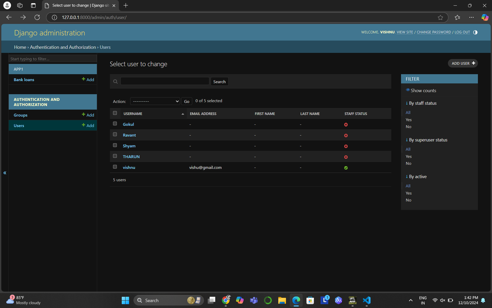
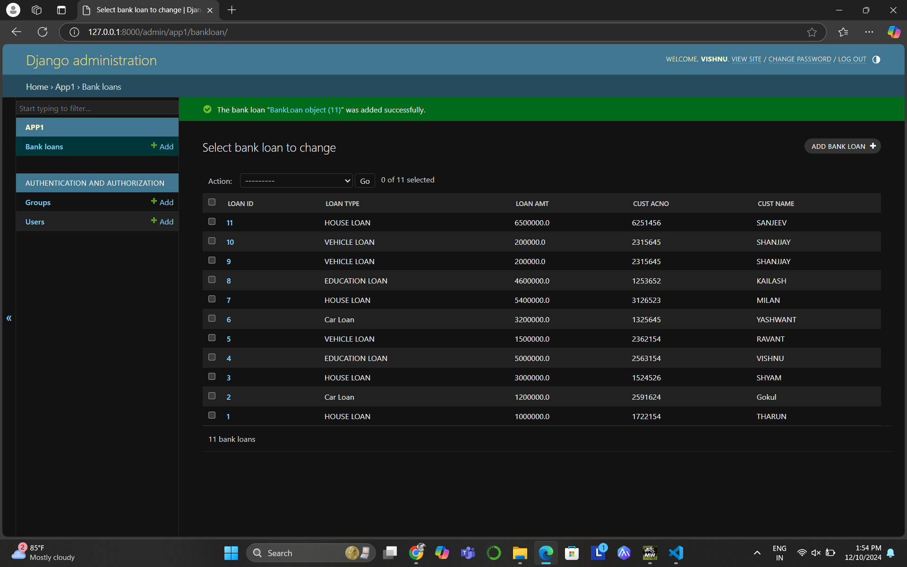

# Ex02 Django ORM Web Application
## Date: 10/12/2024

## AIM
To develop a Django application to store and retrieve data from a bank loan database using Object Relational Mapping(ORM).

## ENTITY RELATIONSHIP DIAGRAM


## DESIGN STEPS

### STEP 1:
Clone the problem from GitHub

### STEP 2:
Create a new app in Django project

### STEP 3:
Enter the code for admin.py and models.py

### STEP 4:
Execute Django admin and create details for 10 books

## PROGRAM
```
models.py
from django.db import models
from django.contrib import admin

# create your models here
class BankLoan(models.Model):
    loan_id = models.IntegerField(primary_key=True)
    loan_type = models.CharField(max_length=100)
    loan_amt = models.FloatField()
    cust_acno = models.IntegerField()
    cust_name = models.CharField(max_length=50)

class BankLoanAdmin(admin.ModelAdmin):
    list_display=('loan_id','loan_type','loan_amt','cust_acno','cust_name')

    admin.py
    from django.contrib import admin
from .models import BankLoan , BankLoanAdmin
# Register your models here.
admin.site.register(BankLoan , BankLoanAdmin)
```


## OUTPUT




## RESULT
Thus the program for creating a database using ORM hass been executed successfully
